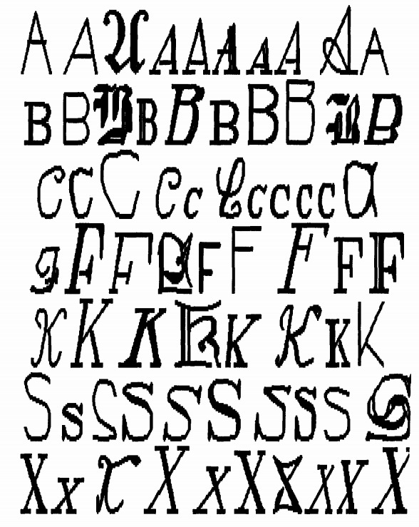

<div align="center">
  <p>
    <a align="center" href="" target="_blank">
      
    </a>
  </p>
  <br>

  <div align="center">
      <a href="https://github.com/tekboart/">
          
      </a>&nbsp;&nbsp;&nbsp;
      <a href="https://www.linkedin.com/in/kyan-bhr/">
          
      </a>&nbsp;&nbsp;&nbsp;
      <a href="https://scholar.google.com/citations?user=r3xmjQUAAAAJ&hl=en">
          
      </a>&nbsp;&nbsp;&nbsp;
      <a href="https://kaggle.com/">
          
      </a>&nbsp;&nbsp;&nbsp;
  </div>
</div>

<hr height="10">

# Classification and Clustering of English letters using Machine Learning (ML) algorithms


The ML algorithms used:
- Classification
  1. Decision Tree
  1. Support Vector Machine (SVM)
  1. Ada Boost (an ensemble method)
- Clustering
  1. Hierarchical clustering (Agglomerative)

## Requirements


<!-- - Please refer to the file `requirements.txt` for a comprehesive list of packages and their corresponding version. -->

## Project Dir Structure
```bash
.
├── data
│   ├── 1. original
│   └── 2. edited
├── images
│   └── logos
├── logs
├── outputs
├── reports
└── utils
    └── jqmcvi

10 directories
```

## Data
The data was obtained from [here](https://archive.ics.uci.edu/ml/datasets/letter+recognition) and was firt used and introduced by Frey and Slate [[1]](#1).

Dataset info:
- Title: Letter Image Recognition Data
- Source Information
  - Creator: David J. Slate
    > Odesta Corporation; 1890 Maple Ave; Suite 115; Evanston, IL 60201
  - Donor: David J. Slate (dave@math.nwu.edu) (708) 491-3867
  - Date: January, 1991
- Number of Instances: 20000
- Number of Attributes: 17 (Letter category and 16 numeric features)
- Attribute Information:
  1.	lettr	capital letter	(26 values from A to Z)
  2.	x-box	horizontal position of box	(integer)
  3.	y-box	vertical position of box	(integer)
  4.	width	width of box			(integer)
  5.	high 	height of box			(integer)
  6.	onpix	total # on pixels		(integer)
  7.	x-bar	mean x of on pixels in box	(integer)
  8.	y-bar	mean y of on pixels in box	(integer)
  9.	x2bar	mean x variance			(integer)
  10.	y2bar	mean y variance			(integer)
  11.	xybar	mean x y correlation		(integer)
  12.	x2ybr	mean of x * x * y		(integer)
  13.	xy2br	mean of x * y * y		(integer)
  14.	x-ege	mean edge count left to right	(integer)
  15.	xegvy	correlation of x-ege with y	(integer)
  16.	y-ege	mean edge count bottom to top	(integer)
  17.	yegvx	correlation of y-ege with x	(integer)

## Contact
<!-- Unfortunately this repo is no longer actively maintained.  -->
Should you have any questions, feel free to contact TekBoArt @tekboart.

## Reference
<a id="1">[1]</a> Frey, P. W., & Slate, D. J. (1991). Letter recognition using Holland-style adaptive classifiers.*Machine learning*,*6*(2), 161-182.

## License
<!-- Creative Common Licenses -->
<!-- "Creative Commons Attribution-NonCommercial-ShareAlike (CC-BY-NC-SA)" -->
Shield: [![CC BY-NC-SA 4.0][cc-by-nc-sa-shield]][cc-by-nc-sa]

<!-- MIT License (can be used commercially) -->
<!-- Shield: [](https://opensource.org/licenses/MIT) -->

- Refer to the file `LICENSE` for more information regarding the license of this repository.

This work is licensed under a
[Creative Commons Attribution-NonCommercial-ShareAlike 4.0 International License][cc-by-nc-sa].

[![CC BY-NC-SA 4.0][cc-by-nc-sa-image]][cc-by-nc-sa]

[cc-by-nc-sa]: http://creativecommons.org/licenses/by-nc-sa/4.0/
[cc-by-nc-sa-image]: https://licensebuttons.net/l/by-nc-sa/4.0/88x31.png
[cc-by-nc-sa-shield]: https://img.shields.io/badge/License-CC%20BY--NC--SA%204.0-lightgrey.svg